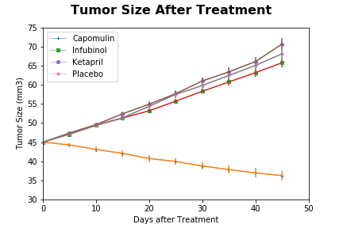

# Pharmacy Trials Python

In this study, 250 mice were treated through a variety of drug regimes over the course of 45 days. 
Their physiological responses were then monitored over the course of that time. 
My objective is to analyze the data to show how four treatments (Capomulin, Infubinol, Ketapril, and Placebo) compare.

To do this I am tasked with:

* Loading then merging data from multiple CSV files into a Pandas Dataframe. 
* Creating a scatter plot that shows how the tumor volume changes over time for each treatment.
* Creating a scatter plot that shows how the number of metastatic (cancer spreading) sites changes over time.
* Creating a scatter plot that shows the number of mice still alive through the course of treatment (Survival Rate)
* Creating a bar graph that compares the total % tumor volume change for each drug across the full 45 days.

**Tools Used:**

* Python libraries: Pandas, Matplotlib, Numpy, Scipy

* Jupyter Notebook

**Graphed Results**

     

       

